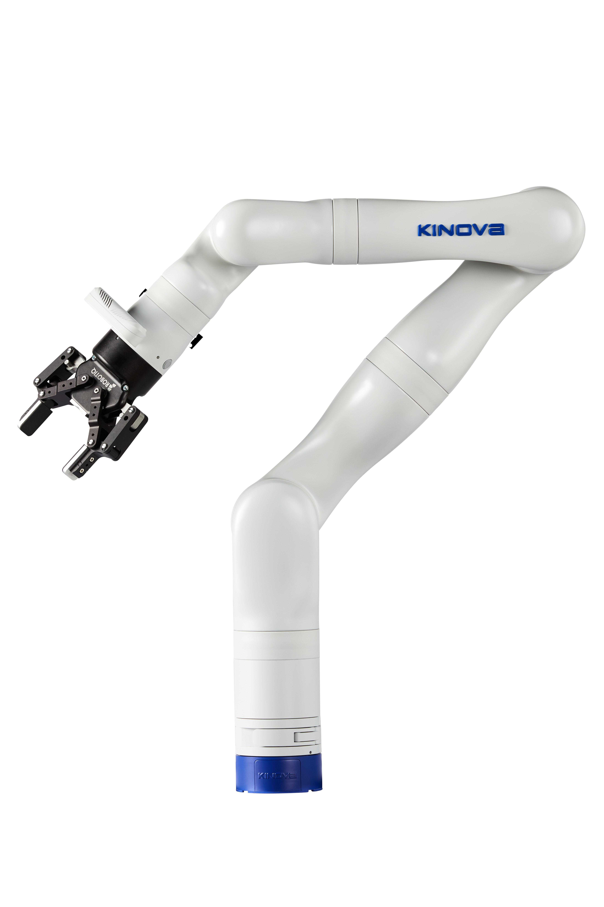

# ROS 2 Kortex
> Kinova® Kortex™ is the common software platform behind all of the products in the Gen3 family (Gen3 and Gen3 lite). It unifies the inner workings of the various robots and their related external tools, like the API. <br />
> https://www.kinovarobotics.com/product/gen3-robots

<center></center>

ROS2 Kortex is the official ROS2 package to interact with Kortex and its related products. It is built upon the Kortex API, documentation for which can be found in the [GitHub Kortex repository](https://github.com/Kinovarobotics/kortex).

## Build status

<table width="100%">
  <tr>
    <th>ROS 2 Distro</th>
    <th>Humble</th>
    <th>Iron</th>
    <th>Rolling</th>
  </tr>
  <tr>
    <th>Branch</th>
    <td><a href="https://github.com/PickNikRobotics/ros2_kortex/tree/main">main</a></td>
    <td><a href="https://github.com/PickNikRobotics/ros2_kortex/tree/main">main</a></td>
    <td><a href="https://github.com/PickNikRobotics/ros2_kortex/tree/main">main</a></td>
  </tr>
  <tr>
    <th>Build Status</th>
    <td>
      <a href="https://github.com/PickNikRobotics/ros2_kortex/actions/workflows/humble-binary-build.yml">
        
      </a>
    </td>
    <td>
      <a href="https://github.com/PickNikRobotics/ros2_kortex/actions/workflows/iron-binary-build.yml">
        
      </a>
    </td>
    <td>
      <a href="https://github.com/PickNikRobotics/ros2_kortex/actions/workflows/rolling-binary-build.yml">
        
      </a>
    </td>
  </tr>
  <tr>
    <th>Release Status</th>
    <td>coming soon<!-- TODO(moriarty) add build.ros2.org status badge once released --></td>
    <td>coming soon<!-- TODO(moriarty) add build.ros2.org status badge once released --></td>
    <td>coming soon<!-- TODO(moriarty) add build.ros2.org status badge once released --></td>
  </tr>
</table>


**Note:** There are several CI jobs checking against future upstream changes see [detailed build status](.github/workflows/README.md) for a full list of CI jobs and for more information.


## Getting started

1. Install ROS 2.

   If you're a developer, we recommend using Rolling to get the latest features and fixes.

   Rolling Release: [Install ROS2 Rolling](https://docs.ros.org/en/rolling/Installation/Ubuntu-Install-Debians.html)<br/>
   Latest Release: [Install ROS2 Iron](https://docs.ros.org/en/iron/Installation/Ubuntu-Install-Debians.html)</br>
   Stable LTS Release: [Install ROS2 Humble](https://docs.ros.org/en/humble/Installation/Ubuntu-Install-Debians.html)

   After installing a version of ROS, source the setup.bash, which will set the `$ROS_DISTRO` environment variable.

2. Install this package from binary
   ```
   sudo apt install ros-$ROS_DISTRO-kortex-bringup
   ```

3. Optional: install MoveIt Configuration and Cyclone DDS

   If you have a 7dof arm:
   ```
   sudo apt install ros-$ROS_DISTRO-kinova-gen3-7dof-robotiq-2f-85-moveit-config
   ```
   If you have a 6dof arm:
   ```
   sudo apt install ros-$ROS_DISTRO-kinova-gen3-6dof-robotiq-2f-85-moveit-config
   ```
   If you plan to use MoveIt, it is recommended to install and use Cyclone DDS.
   ```
   sudo apt install ros-$ROS_DISTRO-rmw-cyclonedds-cpp
   export RMW_IMPLEMENTATION=rmw_cyclonedds_cpp
   ```

4. Go to Usage section

## Contributing to this repository or building from source

Note: It is recommended to use a released binary version of this package and apt install it.
If you want the latest version of this repository for testing latest fixes
check out testing with pre-released binaries: https://docs.ros.org/en/rolling/Installation/Testing.html

If the bug fix you need isn't in a released version or If you want to build this repository from source or contribute back to the repository read on.

1. Make sure that `colcon`, its extensions, and `vcs` are installed:
   ```
   sudo apt install python3-colcon-common-extensions python3-vcstool
   ```

2. Create a new ROS2 workspace:
   ```
   export COLCON_WS=~/workspace/ros2_kortex_ws
   mkdir -p $COLCON_WS/src
   ```

3. Pull relevant packages:
   ```
   cd $COLCON_WS
   git clone https://github.com/Kinovarobotics/ros2_kortex.git src/ros2_kortex
   vcs import src --skip-existing --input src/ros2_kortex/ros2_kortex.$ROS_DISTRO.repos
   vcs import src --skip-existing --input src/ros2_kortex/ros2_kortex-not-released.$ROS_DISTRO.repos
   ```

   If you plan on simulating the robot with ignition or gazebo, make sure to pull the additional simulation packages. If you're on    ROS2 Humble, run
   ```
   vcs import src --skip-existing --input src/ros2_kortex/simulation.humble.repos
   ```

   otherwise
   ```
   vcs import --skip-existing --input src/ros2_kortex/simulation.repos
   ```

   If you plan on using MoveIt, you must make sure that you have it already [installed](https://moveit.ros.org/install-moveit2/binary/) either from binaries or by building it from source.

4. Install dependencies, compile, and source the workspace:
   ```
   rosdep install --ignore-src --from-paths src -y -r
   colcon build --cmake-args -DCMAKE_BUILD_TYPE=Release
   source install/setup.bash
   ```

   By default, colcon will use as much resources as possible to build the ROS2 workspace. This can temporarily freeze or even crash your machine. You can limit the number of threads used to avoid this issue, we found a good tradeoff between build time and resource utilisation by setting it to 3 :
   ```
   colcon build --cmake-args -DCMAKE_BUILD_TYPE=Release --parallel-workers 3
   ```

## Simulation Issues

Please note, at this time there are two known issues you with simulation

1. Gazebo + Mimic Joints for the Robotiq Gripper
2. Protobuf version mismatch

# Gazebo and Mimic Joints

A pull request has been made to gz_ros2_control which is how this repository was tested in simulation.
The pull request won't be merged as the fix should be done upstream in gz-sim.
Once a fix is available ros2_robotiq_gripper will be re-released and an update should fix any workarounds.

In the meantime if you need simulation checkout the upstream pull request link:

- Upstream Issue: https://github.com/gazebosim/gz-sim/issues/1684
- Upstream Pull Request: https://github.com/ros-controls/gz_ros2_control/pull/86
- Tracking Issue: https://github.com/PickNikRobotics/ros2_robotiq_gripper/issues/7

# Protobuf

Due to mismatched protobuf version that ships system and used by Gazebo simulator compiling twice may be required.
You will only run into this if you have certain other gazebo related code in your workspace while compiling this repository.
If errors are encounter you must clean your workspace and run colcon build in two steps:

1. build everything except kortex related packages
2. build the packages that where skipped

```
sudo apt install python3-colcon-clean # if you don't have colcon-clean installed already
colcon clean workspace -y
colcon build --packages-skip-regex '.*kortex.*' '.*gen3.*'
colcon build --packages-select-regex '.*kortex.*' '.*gen3.*'
```

## Usage
To launch and view any of the robot's URDF run:

```bash
ros2 launch kortex_description view_robot.launch.py
```

The accepted arguments are:

* `robot_type` : Your robot model. Possible values are either `gen3` or `gen3_lite`, the default is `gen3`.

* `gripper` : Gripper to use. Possible values for the Gen3 are either `robotiq_2f_85` or `robotiq_2f_140`. For the Gen3 Lite, the only option is `gen3_lite_2f`. Default value is an empty string, which will display the arm without a gripper.

* `dof` : Degrees of freedom of the arm. Possible values for the Gen3 are either `6` or `7`. For the Gen3 Lite, the only option is `6`. Default value is `7`.

### Gen 3 Robots

The `gen3.launch.py` launch file is designed to be used for Gen3 arms. The typical use case to bringup and visualize the 7 DoF Kinova Gen3 robot arm (default) with mock hardware on Rviz:

```bash
ros2 launch kortex_bringup gen3.launch.py \
  robot_ip:=yyy.yyy.yyy.yyy \
  use_fake_hardware:=true
```

Alternatively, for a physical robot:

```bash
ros2 launch kortex_bringup gen3.launch.py \
  robot_ip:=192.168.1.10 \
```
You can specify the following arguments if you wish to change your arm configuration:

* `robot_type`: Your robot model. Default value (and only one) is `gen3`.

* `gripper` : Gripper to use. Possible values for the Gen3 are either `robotiq_2f_85`, `robotiq_2f_140` or `""`. Default is `robotiq_2f_85`. An empty string will not initialise any gripper.

* `gripper_joint_name` : Name of the controlled joint of the gripper attached to the arm. Default value is `robotiq_85_left_knuckle_joint`.

* `use_internal_bus_gripper_comm` : Use internal bus for gripper communication. Default value is `true`.

* `gripper_max_velocity` : Max velocity for gripper commands. Default value is `100.0`.

* `gripper_max_force` : Max force for gripper commands. Default value is `100.0`.

* `dof` : Degrees of freedom of the arm. Possible values are either `6` or `7`.Default value is `7`.

* `robot_ip` : IP address by which the robot can be reached. No default is specified, this is a required argument. All arms are shipped with address `192.168.1.10`, but if you have reassigned your physical arm's robot IP address, then you will need to assign that ip address.

* `use_fake_hardware` : Start robot with fake hardware mirroring command to its states. Default value is `false`.

* `fake_sensor_commands` : Enable fake command interfaces for sensors used for simple simulations. Used only if 'use_fake_hardware' parameter is true. Default value is `false`.

* `robot_controller` : Robot controller to start. Possible values are `twist_controller` and `joint_trajectory_controller`.Default value is `joint_trajectory_controller`.

* `controllers_file` : Ros 2 control configuration file to use. Default value is `ros2_controllers.yaml`

* `launch_rviz` : Start an Rviz window to visualize the robot. Default value is `true`.

#### Robotiq gripper

The Robotiq 2f 85 (or 2f 140) Gripper will be available on the Action topic:

```bash
/robotiq_gripper_controller/gripper_cmd
```

You can test the gripper by calling the Action server with the following command and setting the desired `position` of the gripper (`0.0=open`, `0.8=close`)

```bash
ros2 action send_goal /robotiq_gripper_controller/gripper_cmd control_msgs/action/GripperCommand "{command:{position: 0.0, max_effort: 100.0}}"
```

#### Vision Module

In order to access the Kinova Vision module's depth and color streams for the camera-equipped Gen3 arm models, please refer to the following github repository for detailed instructions: [ros2_kortex_vision](https://github.com/PickNikRobotics/ros2_kortex_vision)

While following the instructions, please take note of the following points:
1. There is no need to install the `rgbd_launch` ROS package
2. Establishing a connection between the computer and the camera may require several attempts, so please be patient. Sometimes you may need to restart both the robot and the connected computer to successfully establish the connection.
3. Before setting the `depth_registration` argument to `true` in the `kinova_vision.launch.py` file, make sure to install the `image_proc` ROS package on your system using the following command:

```bash
sudo apt install ros-$ROS_DISTRO-depth-image-proc
```

4. After starting the `kinova_vision.launch.py` file, open RViz and add the desired camera topics to visualize the captured scene.

### Gen 3 Lite Robot

The `gen3_lite.launch.py` launch file is designed to be used for Gen3 Lite arms. The typical use case to bringup the robot arm with mock hardware:

```bash
ros2 launch kortex_bringup gen3_lite.launch.py \
  robot_ip:=yyy.yyy.yyy.yyy \
  use_fake_hardware:=true
```
Alternatively, if you wish to use the physical robot:

```bash
ros2 launch kortex_bringup gen3_lite.launch.py \
  robot_ip:=192.168.1.10 \
```

You can specify the following arguments if you wish to change your arm configuration:

* `robot_type`: Your robot model. Default value (and only one) is `gen3_lite`.

* `gripper` : Gripper to use. Default value (and only one) is `gen3_lite_2f`.

* `gripper_joint_name` : Name of the controlled joint of the gripper attached to the arm. Default value (and only one) is `right_finger_bottom_joint`.

* `use_internal_bus_gripper_comm` : Use internal bus for gripper communication. Default value is `true`.

* `gripper_max_velocity` : Max velocity for gripper commands. Default value is `100.0`.

* `gripper_max_force` : Max force for gripper commands. Default value is `100.0`.

* `robot_ip` : IP address by which the robot can be reached. No default is specified, this is a required argument. All arms are shipped with address `192.168.1.10`, but if you have reassigned your physical arm's robot IP address, then you will need to assign that ip address. If you're using an USB to Ethernet interface to connect your robot to your machine instead of USB via RNDIS, the ip address will be `192.168.2.10`.

* `use_fake_hardware` : Start robot with fake hardware mirroring command to its states. Default value is `false`.

* `fake_sensor_commands` : Enable fake command interfaces for sensors used for simple simulations. Used only if 'use_fake_hardware' parameter is true. Default value is `false`.

* `robot_controller` : Robot controller to start. Possible values are `twist_controller` and `joint_trajectory_controller`.Default value is `joint_trajectory_controller`.

* `controllers_file` : Ros 2 control configuration file to use. Default value is `ros2_controllers.yaml`

* `description_file` : URDF/XACRO description file with the robot. Default value is `gen3_lite_gen3_lite_2f.xacro`.

* `launch_rviz` : Start an Rviz window to visualize the robot. Default value is `true`.


## Simulation
The `kortex_sim_control.launch.py` launch file is designed to simulate all of our arm models, you just need to specify your configuration through the arguments. By default, the Gen3 7 dof configuration is used :

```bash
ros2 launch kortex_bringup kortex_sim_control.launch.py \
  use_sim_time:=true \
  launch_rviz:=false
```

* `sim_ignition` : Use Ignition for simulation. Default value is `true`.
* `sim_gazebo` : Use Gazebo Classic for simulation. Default value is `false`.
* `robot_type` : Your robot model. Possible values are either `gen3` or `gen3_lite`.Default is `gen3`.
* `robot_name` : Name you would like your robot to have. Default value is `gen3`.
* `dof` : Degrees of freedom of the arm. Possible values are either `6` or `7`.Default value is `7`.
* `vision` : Use arm mounted realsens. Possible values are either `true` or `false`. Default value is `false`. This option does not generate simulated images, it only loads up the robot's URDF that includes the vision link.
* `robot_controller` : Robot joint controller to start. Default value is `joint_trajectory_controller`.
* `robot_pos_controller` : Robot position controller to start. Default value is `twist_controller`.
* `robot_hand_controller` : Robot gripper controller to start. Default value is `robotiq_gripper_controller`.
* `controllers_file` :  Ros 2 control configuration file to use. Default value is `ros2_controllers.yaml`
* `description_package` : Description package with robot URDF/XACRO files. Default value is `kortex_description`.
* `description_file` : URDF/XACRO description file with the robot. Default value is `kinova.urdf.xacro`.
* `prefix` : Prefix of the joint names, useful for multi-robot setup. If changed, then also joint names in the controllers' configuration have to be updated. Default value is `""` (none).
* `use_sim_time` : Use simulated clock. Default value is `true`.
* `gripper` : Gripper to use. Possible values for the Gen3 are either `robotiq_2f_85`, `robotiq_2f_140` or `""`. Default is `robotiq_2f_85`. An empty string will not initialise any gripper.

#### MoveIt2

To generate motion plans and execute them with a simulated 7 DoF Kinova Gen3 arm with mock hardware:

```bash
ros2 launch kinova_gen3_7dof_robotiq_2f_85_moveit_config robot.launch.py \
  robot_ip:=yyy.yyy.yyy.yyy \
  use_fake_hardware:=true
```

and to bring up the Kinova Gen3 6 DoF with MoveIt:

```bash
ros2 launch kinova_gen3_6dof_robotiq_2f_85_moveit_config robot.launch.py \
  robot_ip:=yyy.yyy.yyy.yyy \
  use_fake_hardware:=true
```

To generate motion plans and execute them with an ignition simulated 7 DoF Kinova Gen3 arm (previously launched with the command at the [simulation](#simulation) section):

```bash
ros2 launch kinova_gen3_7dof_robotiq_2f_85_moveit_config sim.launch.py \
  use_sim_time:=true
```

To work with a physical robot and generate/execute paths with MoveIt run the following:

For Gen3:

```bash
ros2 launch kinova_gen3_7dof_robotiq_2f_85_moveit_config robot.launch.py \
  robot_ip:=192.168.1.10
```

For Gen3-Lite:

```bash
ros2 launch kinova_gen3_lite_moveit_config robot.launch.py \
  robot_ip:=192.168.1.10
```


## Commanding the arm (physically and in simulation)
You can command the arm by publishing Joint Trajectory messages directly to the joint trajectory controller:

```bash
ros2 topic pub /joint_trajectory_controller/joint_trajectory trajectory_msgs/JointTrajectory "{
  joint_names: [joint_1, joint_2, joint_3, joint_4, joint_5, joint_6, joint_7],
  points: [
    { positions: [0, 0, 0, 0, 0, 0, 0], time_from_start: { sec: 10 } },
  ]
}" -1
```

Depending on your robot type and its DoF, you will need to adapt the `joint_names` and `positions` properties accordingly. For the Gen3 Lite arm, the integrated gripper is considered as a joint, so to command it, it must be included in the `joint_names` array. (`0.0=open`, `1.0=close`):

```bash
ros2 topic pub /joint_trajectory_controller/joint_trajectory trajectory_msgs/JointTrajectory "{
  joint_names: [joint_1, joint_2, joint_3, joint_4, joint_5, joint_6, right_finger_bottom_joint],
  points: [
    { positions: [0, 0, 0, 0, 0, 0, 1], time_from_start: { sec: 10 } },
  ]
}" -1
```

You can also command the arm using Twist messages. Before doing so, you must active the `twist_controller` and deactivate the `joint_trajectory_controller`:
```bash
ros2 service call /controller_manager/switch_controller controller_manager_msgs/srv/SwitchController "{
  activate_controllers: [twist_controller],
  deactivate_controllers: [joint_trajectory_controller],
  strictness: 1,
  activate_asap: true,
}"
```

**Note: the required interface for the `twist_controller` does not currently exist in the gazebo or mock hardware simulation setups. So the `twist_controller` is currently only functional on Kinova hardware.**

Once the `twist_controller` is activated, You can publish Twist messages on the `/twist_controller/commands` topic to command the arm.

For example, you can jog the arm using [Teleop Twist Keyboard](https://index.ros.org/p/teleop_twist_keyboard/github-ros2-teleop_twist_keyboard/) with the following command:

**WARNING: you are responsible for collision checking, including self collisions when in this mode.**

```bash
ros2 run teleop_twist_keyboard teleop_twist_keyboard --ros-args --remap /cmd_vel:=/twist_controller/commands
```

If you wish to use the `joint_trajectory_controller` again to command the arm using JointTrajectory messages, run the following:
```bash
ros2 service call /controller_manager/switch_controller controller_manager_msgs/srv/SwitchController "{
  activate_controllers: [joint_trajectory_controller],
  deactivate_controllers: [twist_controller],
  strictness: 1,
  activate_asap: true,
}"
```

## Contents

The following is a description of the packages included in this repository.

### kortex_description
This package contains the URDF (Unified Robot Description Format), STL and configuration files for the Kortex-compatible robots. For more details, please consult the [README](kortex_description/readme.md) from the package subdirectory.

### kortex_driver
This package implements a ROS node that allows communication between a node and a Kinova Gen3 or Gen3 lite robot. For more details, please consult the [README](kortex_driver/readme.md) from the package subdirectory.

### kortex_moveit_config
This metapackage contains the auto-generated MoveIt! files to use the Kinova Gen3 and Gen3 lite arms with the MoveIt! motion planning framework. For more details, please consult the [README](kortex_moveit_config/readme.md) from the package subdirectory.
